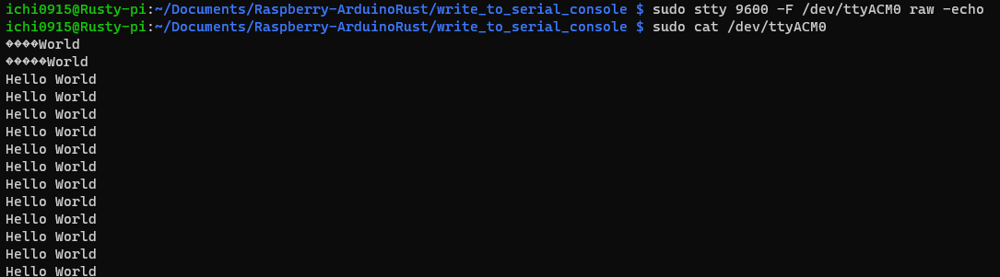

# Write To Serial Port

In this code we will write to the serial console.

## Hardware Required:
* Raspberry pi
* Arduino Uno
* USB 2.0 cable type A/B

## Compiling the projects and flashing to Arduino
```bash
cargo build
sudo avrdude -p m328p -c arduino -P /dev/ttyACM0 -b 115200 -U flash:w:target/avr-atmega328p/debug/write_to_serial_console.elf
```

## Reading/writing to serial port from terminal

As you know everything in linux is a file and so are the serial ports which are represented by files in the /dev directory. It is through these files that Linux OS communicates with an external device on the serial port.

To transfer something to an external device you need to write data to this file, and to read information from the device you need to read the data from this file.

We use this 3 commands to work with the COM ports:
* stty	- Sets the parameters and speed of the COM port
* cat	- Reads from the COM ports
* echo	- Writes to the COM ports

The stty command has the following format:

```code
stty [-F DEVICE | --file=DEVICE] [SETTING]...
```
For our case we will use the following command to set the the port:
```bash
sudo stty 9600 -F /dev/ttyUSB0 raw -echo
```

And the following command to read from the port:
```bash
sudo cat /dev/ttyACM0
```

## Result:

